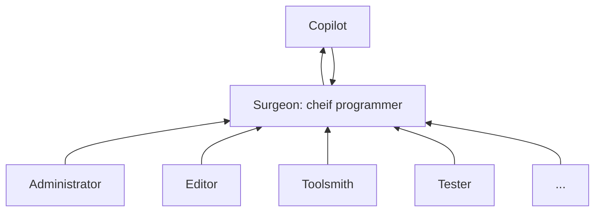

# Mythical Man-Month
## Chapter 2 : The Mythical Man-Month
- The author had been successfully using the following rule of thumb for scheduling a software task:
  - 1/3 planning
  - 1/6 coding
  - 1/4 component test and early system test
  - 1/4 system test, all components in hand
- Oversimplifying outrageously, we state Brooks's Law:
  - Adding manpower to a late software project makes it later.

## Chatper 3 : The Surgical Team
- Productivity variations (best vs worst)
  - 10:1 on productivity
  - 5:1 on program speed and space
  - **The data showed no correlation whatsoever between experience and performance** (It seems quite shocking to me and I agree with that this would not be universally true)

- Keep as few minds as possible
  - 200-man project with 25 managers $\rightarrow$ Fire 175 troops and put the managers back to programming?
  - The program is possible to be remained obsolete since few minds take more time even if they are sharp and the communication cost decreased dramatically

- Mills's proposal: Reconciling between two needs: keeping few minds vs timely requirements
  - Each segment of a large job is tackled by a team
  - Each team to be organized like a surgical team
  - The team consists of many people who work in their professionals
    - But the system is the product of one mind (The surgeon) or at most two.

